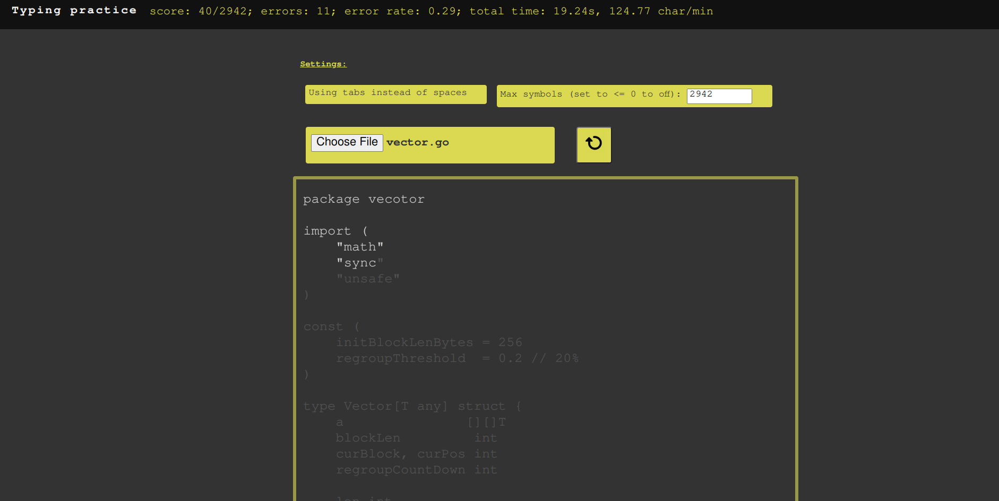

# How to run
To start an app, open `./gui/index.html`, or manually open it in your browser. You can also explore **Python** and **Golang** samples in a `sample` directory.  
  
The timer starts with the first letter and stops at the end of the line when <enter> is pressed. The maximum symbol stop is not strict, it stopps at the end of the line.  
  

